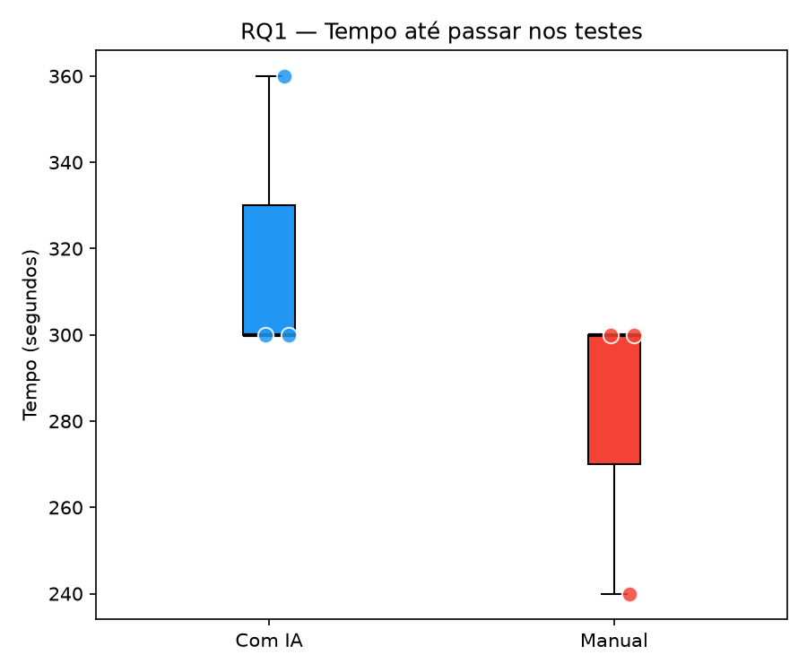
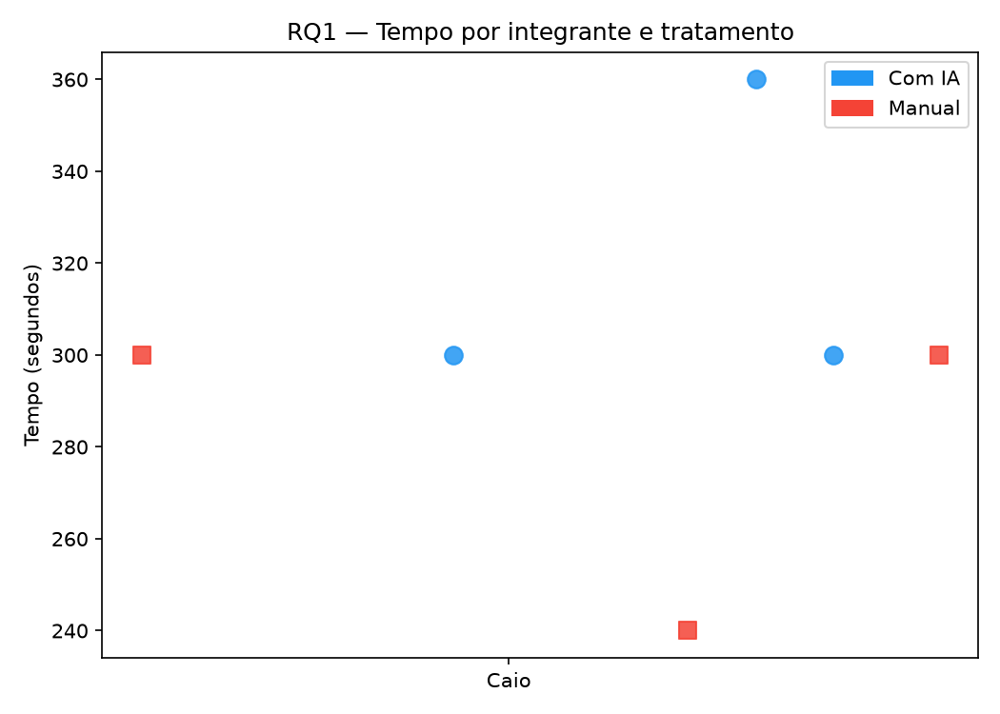
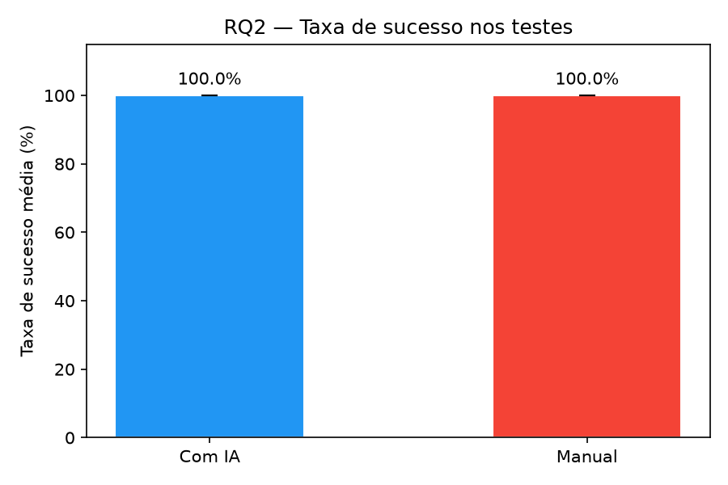

# Análise Estatística — RQ1 e RQ2 (S03)

**Responsável:** Henrique Volponi · **Issue:** #47

---

## Dados utilizados

| Coluna | Trials completos |
|--------|-----------------|
| `tempo_s` | 6/18 |
| `taxa_sucesso` | 6/18 |

> **Limitação:** apenas o integrante Caio possui tempo registrado. Henrique e Jonas ainda não registraram seus tempos (ver notas em `data/trials.csv`). A análise de RQ1 reflete somente os 6 trials do Caio (3 IA, 3 Manual).

---

## RQ1 — Tempo até passar nos testes (time-to-green)

**H0:** não há diferença no tempo entre os tratamentos.
**H1:** o uso de IA reduz o tempo até passar nos testes.

### Estatísticas descritivas

| Tratamento | n | Mediana (s) | Média (s) | DP (s) |
|-----------|---|------------|----------|--------|
| Com IA | 3 | 300 | 320 | 35 |
| Manual | 3 | 300 | 280 | 35 |

### Teste estatístico

Mann-Whitney U=7.0, p=0.3017, r=-0.556 (grande)

### Interpretação

Com apenas 6 trials com tempo registrado, qualquer conclusão é preliminar. Os dados do Caio indicam que os tempos com IA (mediana 300s) e sem IA (mediana 300s) foram similares, sem diferença estatisticamente significativa. A análise completa depende do preenchimento dos tempos de Henrique e Jonas.

### Visualizações

---

## RQ2 — Taxa de sucesso nos testes

**H0:** não há diferença na taxa de sucesso entre os tratamentos.
**H1:** o uso de IA aumenta a taxa de sucesso.

### Estatísticas descritivas

| Tratamento | n | Média (%) |
|-----------|---|----------|
| Com IA | 3 | 100.0% |
| Manual | 3 | 100.0% |

### Teste estatístico

Não aplicável — variância zero (100% de sucesso em todos os trials) ou dados ausentes.

### Interpretação

Todos os trials com dados registrados atingiram 100% de taxa de sucesso nos dois tratamentos. Não há variância para detectar diferença — não é possível rejeitar nem confirmar H0 com esses dados. Isso indica que os katas, dentro do time-box de 35 min, foram resolvíveis com ou sem IA para os participantes que completaram os trials.

### Visualização

---

## Resumo

| RQ | Resultado | Tamanho de efeito | Conclusão |
|----|----------|------------------|-----------|
| RQ1 — Tempo | p=0.3017 | r=-0.556 | Não significativo — dados insuficientes |
| RQ2 — Taxa | n/a | n/a | Variância zero — análise inviável |

> Análise deverá ser refeita após preenchimento completo de `tempo_s` para Henrique e Jonas.
