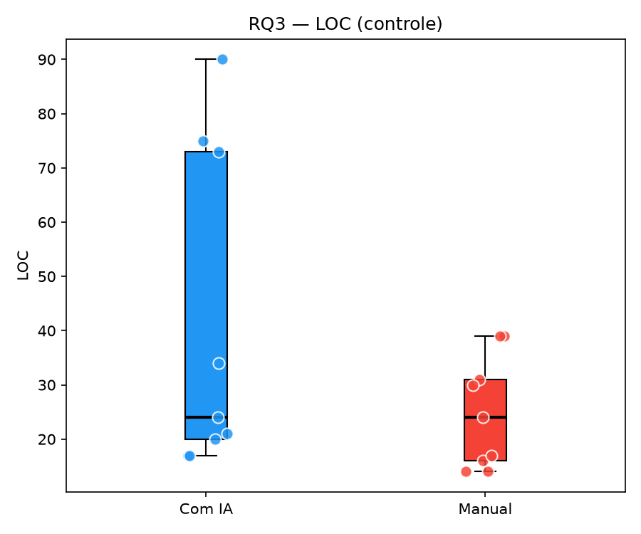
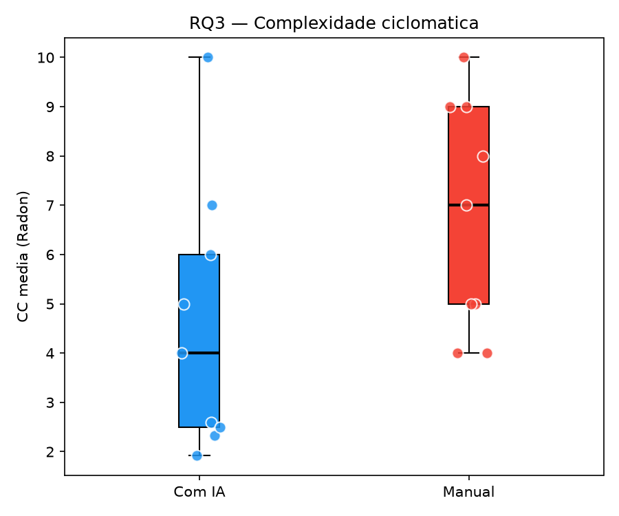
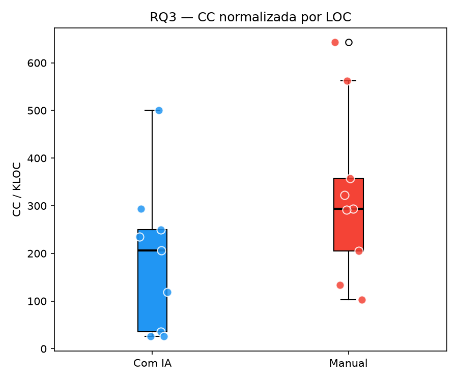
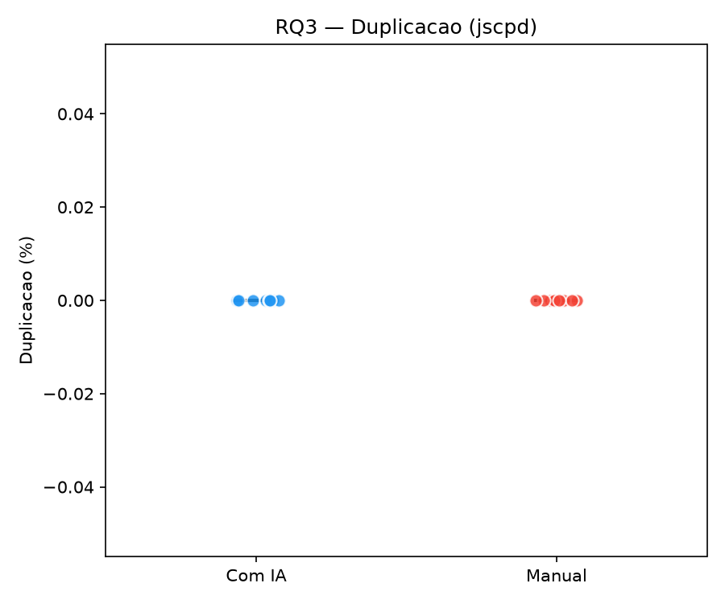

# RQ3 — Análise de estrutura do código (S03)

**Responsável:** Caio · **Issue:** #40

Depende da Issue #38 (`loc`, `duplicacao_pct`) e do enriquecimento `cc_mean` (Radon).

---

## Goal / hipóteses

**H0:** não há diferença na complexidade ciclomática média nem na duplicação entre tratamentos.
**H1:** o uso de assistente de IA altera complexidade e/ou duplicação.

LOC entra como **métrica de controle** (código de IA tende a ser mais verboso). A complexidade também é reportada normalizada: `cc_por_kloc = cc_mean / loc * 1000`.

## Dados

| Coluna | Trials |
|--------|--------|
| `loc` | 18/18 |
| `cc_mean` | 18/18 |
| `duplicacao_pct` | 18/18 |

N = 18 trials (9 IA + 9 Manual). Inferência: Mann-Whitney (amostras independentes por tratamento); descritivo: **mediana + IQR**.

---

## LOC (controle)

| Tratamento | n | Mediana | IQR |
|------------|---|---------|-----|
| Com IA | 9 | 24.0 | 53.0 |
| Manual | 9 | 24.0 | 15.0 |

Mann-Whitney U=53.5, p=0.2680, r=-0.321 (medio)

Sem evidencia de diferenca significativa em LOC (alfa=0.05).

---

## Complexidade ciclomática média (Radon `cc`)

| Tratamento | n | Mediana CC | IQR |
|------------|---|------------|-----|
| Com IA | 9 | 4.000 | 3.500 |
| Manual | 9 | 7.000 | 4.000 |

Mann-Whitney U=21.0, p=0.0915, r=0.481 (medio)

Sem evidencia de diferenca significativa em complexidade ciclomática (alfa=0.05).

### Normalizada por LOC (`cc_por_kloc`)

| Tratamento | n | Mediana | IQR |
|------------|---|---------|-----|
| Com IA | 9 | 205.882 | 214.384 |
| Manual | 9 | 294.118 | 152.015 |

Mann-Whitney U=21.5, p=0.1022, r=0.469 (medio)

Sem evidencia de diferenca significativa em CC normalizada por LOC (alfa=0.05).

---

## Duplicação (`duplicacao_pct`, jscpd)

| Tratamento | n | Mediana (%) | IQR |
|------------|---|-------------|-----|
| Com IA | 9 | 0.0000 | 0.0000 |
| Manual | 9 | 0.0000 | 0.0000 |

Nao aplicavel — variancia zero entre os tratamentos.

Sem evidencia inferencial para diferenca em duplicacao.

> Katas curtas (um único `solucao.py`) frequentemente resultam em 0% de duplicação no jscpd (sem clones >= 5 linhas). Isso limita a sensibilidade da comparação — LOC e CC carregam mais sinal neste N.

---

## Resumo RQ3

| Métrica | Teste | Conclusão |
|---------|-------|-----------|
| LOC (controle) | Mann-Whitney U=53.5, p=0.2680, r=-0.321 (medio) | Sem evidencia de diferenca significativa em LOC (alfa=0.05). |
| CC média | Mann-Whitney U=21.0, p=0.0915, r=0.481 (medio) | Sem evidencia de diferenca significativa em CC (alfa=0.05). |
| CC / KLOC | Mann-Whitney U=21.5, p=0.1022, r=0.469 (medio) | Sem evidencia de diferenca significativa em CC/KLOC (alfa=0.05). |
| Duplicação % | Nao aplicavel — variancia zero entre os tratamentos. | Sem evidencia inferencial para diferenca em duplicacao. |

### Interpretação geral

A comparação IA vs Manual na estrutura do código usa os 18 trials com métricas estáticas. LOC controla verbosidade; CC é olhada crua e normalizada. Duplicação via jscpd em arquivos pequenos tende a zero — interpretar com cautela. Preferimos mediana/IQR e Mann-Whitney dado o N reduzido (consistente com o desenho do laboratório).
