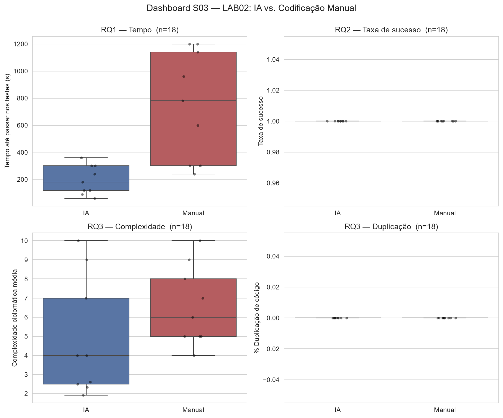

# Dashboard S03 — LAB02

Painel consolidado recalculado diretamente de `data/trials.csv` (Issue #41).

## Completude dos dados

- **tempo_s (RQ1)**: 18/18 trials preenchidos ({'Caio': 6, 'Henrique': 6, 'Jonas': 6})
- **taxa_sucesso (RQ2)**: 18/18 trials preenchidos ({'Caio': 6, 'Henrique': 6, 'Jonas': 6})
- **cc_mean (RQ3)**: 18/18 trials preenchidos ({'Caio': 6, 'Henrique': 6, 'Jonas': 6})
- **duplicacao_pct (RQ3)**: 18/18 trials preenchidos ({'Caio': 6, 'Henrique': 6, 'Jonas': 6})

## RQ1 — Tempo

| tratamento   |   n |   mediana |   q1 |   q3 |
|:-------------|----:|----------:|-----:|-----:|
| IA           |   9 |       180 |  120 |  300 |
| Manual       |   9 |       780 |  300 | 1140 |

Wilcoxon pareado (n=3 pares): p=0.5000
Mann-Whitney (n=9 vs 9): p=0.0039 *

## RQ2 — Taxa de sucesso

| tratamento   |   n |   mediana |   q1 |   q3 |
|:-------------|----:|----------:|-----:|-----:|
| IA           |   9 |         1 |    1 |    1 |
| Manual       |   9 |         1 |    1 |    1 |

Wilcoxon pareado (n=3 pares): p=1.0000
Mann-Whitney (n=9 vs 9): p=n/d

## RQ3 — Complexidade

| tratamento   |   n |   mediana |   q1 |   q3 |
|:-------------|----:|----------:|-----:|-----:|
| IA           |   9 |         4 |  2.5 |    7 |
| Manual       |   9 |         6 |  5   |    8 |

Wilcoxon pareado (n=3 pares): p=0.5000
Mann-Whitney (n=9 vs 9): p=0.1202

## RQ3 — Duplicação

| tratamento   |   n |   mediana |   q1 |   q3 |
|:-------------|----:|----------:|-----:|-----:|
| IA           |   9 |         0 |    0 |    0 |
| Manual       |   9 |         0 |    0 |    0 |

Wilcoxon pareado (n=3 pares): p=1.0000
Mann-Whitney (n=9 vs 9): p=n/d

*(marcado com \* = p < 0.05)*